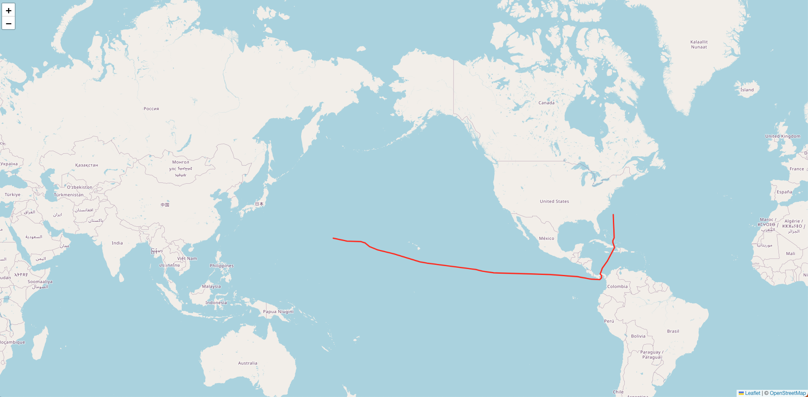

# meridian

## data sort
```
trackData.sort(function (a, b) {
    if (a.updated > b.updated) {
        return 1;
    }
    if (a.updated < b.updated) {
        return -1;
    }
    // a must be equal to b
    return 0;
});
```

## meridian 180 issue
```
let coordinates = [];
let firstLng = parseFloat(trackData[0].longitude)
let lastLng = parseFloat(trackData[trackData.length-1].longitude)
let abs = firstLng - lastLng

if(Math.abs(abs) > 180 || (firstLng < 0 && lastLng < 0)){
    trackData.forEach((coordinate) => {
        let lng = parseFloat(coordinate.longitude);
        if(lng < 0){
            lng += 360
        }
        coordinates.push([parseFloat(coordinate.latitude), lng]);
    })
} else {
    trackData.forEach((coordinate) => {
        let lng = parseFloat(coordinate.longitude);
        if(firstLng < 0){
            lng += 360
        }
        coordinates.push([parseFloat(coordinate.latitude), lng]);
    })

}
var polyline = L.polyline(coordinates, { color: "red" }).addTo(
    this.map
);
```
